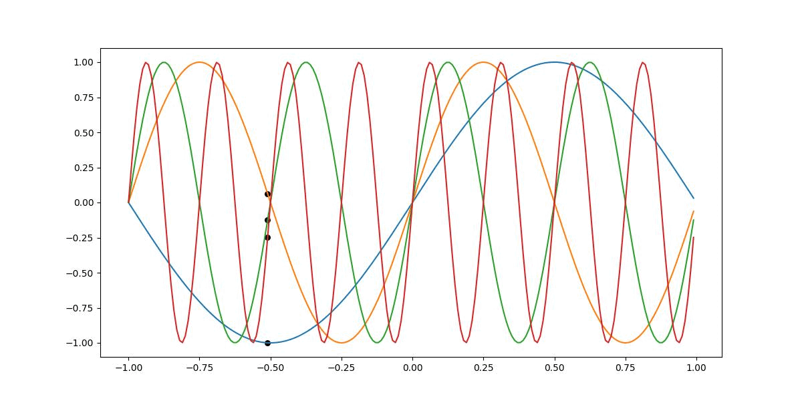

# neural radiance fields (NeRF)

A spelled-out study of neural radiance fields (NeRFs). Contains a PyTorch implementation + ground-up explanation (or at least my logical interpretation) of [this paper](https://arxiv.org/pdf/2003.08934.pdf).

# positional encodings
A key contributor to the success of neural radiance fields is positional encoding. In the paper, the authors explained that positional encoding helps transform the 5-dimensional input positional data (x, y, z, $\theta$, $\phi$) to a higher frequency domain, which in turn allows a neural network to learn data with higher frequency variation, such as color and geometry.

A common technique to perform positional encoding is to a vector of sinusoidal functions of varying frequency bands to transform a scalar value to a vector of positional embeddings.

In the above example, we use a sinusoidal function of 4 frequency bands, represented by the red, yellow, green and blue curves, to transform a single point to 4-dimensions. As the point progresses along the x-axis, we can see higher frequency changes in its positional embeddings (black points).

The encoding function used in NeRF is as follows
$$\gamma(p) = (sin(2^0 \pi p), cos(2^0 \pi p), sin(2^1 \pi p), cos(2^1 \pi p), ... , sin(2^{L-1} \pi p), cos(2^{L-1} \pi p))$$

